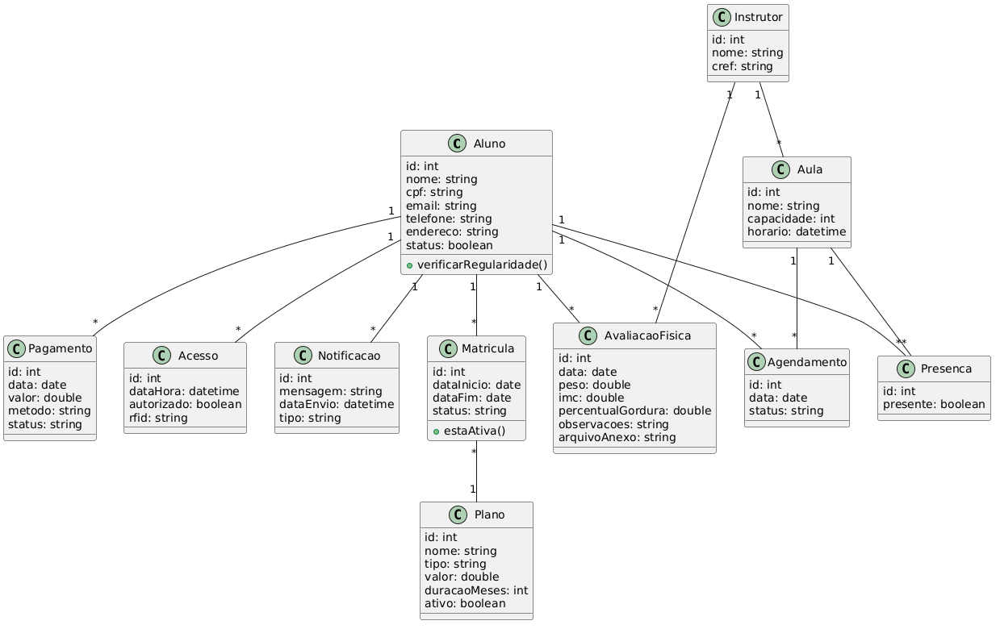

# Diagrama de Domínio - Fitpass

Este projeto apresenta o diagrama de classes do sistema FitPass, desenvolvido com base nos requisitos fornecidos.

## Funcionalidades

* Cadastro de alunos
* Gerenciamento de planos
* Controle de pagamentos
* Controle de acesso por RFID
* Agendamento de aulas
* Registro de presença
* Avaliação física
* Notificações

## Diagrama

## Aplicativo utilizado

* PlantNum

## Autor

Vitor
